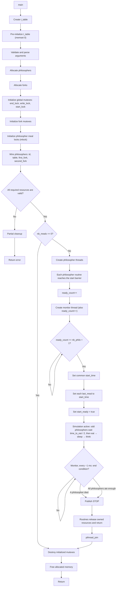

*This project has been created as part of the 42 curriculum by hbekka.*

# Philosophers

## Description

Philosophers is an implementation of the Dining Philosophers problem using POSIX threads and mutexes.

**Goal:** philosophers sit around a table and alternately eat, sleep and think. To eat, each one needs the two forks next to them. The program must simulate this without data races or deadlocks, print every state change, and stop as soon as a philosopher dies or everyone has eaten enough.

Each philosopher is a thread, each fork is a mutex, and a separate monitor thread detects deaths and the end of the meals.

The following graph represents the lifecycle of the program and the order used to make resources valid before concurrent execution begins.



The main invariants are:

- no thread uses a resource before that resource is valid;
- all philosophers start from a common time reference;
- threads terminate before mutex destruction and memory release;
- initialization counters and flags allow partial cleanup after an error.

### Design choices

| Problem | Choice |
|---|---|
| Deadlock | Fork order is fixed at init: even ids take left then right, odd ids take right then left. No circular wait is possible. |
| Fair start | Odd philosophers start with a `time_to_eat / 2` delay. With an odd count, thinking lasts `2 * time_to_eat - time_to_sleep` so everyone gets a turn. |
| Data races | `mlock` protects `last_meal` and `meals_eaten`, `end_lock` protects the stop flag, `start_lock` protects the start barrier. |
| Output | `write_lock` allows one `printf` at a time. For `died`, the stop flag is raised under this lock, so no message can follow it. |
| Death check | The monitor checks every philosopher about every 1 ms and prints `died` while holding its `mlock`. |
| Precise sleep | `ft_usleep` sleeps in 1 ms slices and checks the stop flag, so threads exit quickly. |
| One philosopher | Takes the only fork and waits for the monitor to announce the death. |
| Errors | Invalid arguments print `Error: ...` on stderr and return 1. Every failure after allocation goes through `ft_clear`. |

## Instructions

Compile the project with:

```bash
make
```

Run it with:

```bash
./philo number_of_philosophers time_to_die time_to_eat time_to_sleep [number_of_times_each_philosopher_must_eat]
```

Arguments must be integers between 1 and `INT_MAX`. The last argument may be 0.

### Examples

```text
$ ./philo 1 800 200 200
0 1 has taken a fork
800 1 died

$ ./philo 4 310 200 100
...
312 2 died

$ ./philo 5 800 200 200 3
1 2 has taken a fork
1 2 has taken a fork
1 2 is eating
...                     (stops when each philosopher has eaten 3 times, no death)

$ ./philo 4 410 200 200          # runs without any death
$ ./philo 200 800 200 200 5      # no death

$ ./philo 5 abc 1 1
Error: arguments must be positive integers
$ ./philo 2 2147483648 1 1
Error: value exceeds INT_MAX
$ ./philo 0 800 200 200
Error: values must be strictly positive
$ ./philo 5 800
Error: wrong number of arguments
```


## Resources

- [The Dining Philosophers problem (Wikipedia)](https://en.wikipedia.org/wiki/Dining_philosophers_problem): origin of the problem and classic solutions.
- [POSIX Threads Programming (LLNL tutorial)](https://hpc-tutorials.llnl.gov/posix/): threads, mutexes and synchronization.
- Man pages: `pthread_create(3)`, `pthread_join(3)`, `pthread_mutex_init(3)`, `pthread_mutex_lock(3)`, `gettimeofday(2)`, `usleep(3)`.
- *Operating Systems: Three Easy Pieces*, chapters on concurrency and locks: <https://pages.cs.wisc.edu/~remzi/OSTEP/>.
- The 42 Philosophers subject.

### Use of AI

AI was used as a pedagogical tool, not to write the program for me:

- **Concepts**: discussing concurrency, data races, deadlocks, synchronization and memory lifetime.
- **Architecture**: reviewing my reasoning while I built the program graph (start barrier, stop flag, cleanup order).
- **Review**: pointing out compilation errors and checking the code against the Norm.
- **Documentation**: turning my handwritten graph into the Mermaid diagram and helping write this README.

The implementation choices and the code remain my own work.
# Philosopher_For_Evaluation
